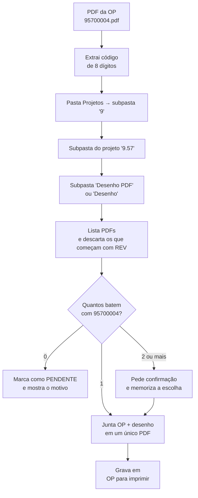

# OP + Desenho — impressão de ordens de produção do SIGER

**Projeto iniciado em:** 22/08/2026
**Status:** Fase 1 implementada em `op-desenhos.html`
**Repositório:** `tecnodrill-planos` — mesma linha de ferramentas de `index.html` (Planos 5W2H) e `custo-producao.html` (Custo de Produção)

---

## 1. O problema

Hoje, para levar uma ordem de produção ao chão de fábrica, alguém precisa:

1. Salvar o PDF da OP exportada do SIGER (nome = código de 8 dígitos, ex.: `95700004`).
2. Abrir o **servidor de engenharia** → pasta `Projetos`.
3. Descobrir, de cabeça, em qual das 9 pastas (`1` a `9`) aquele código mora.
4. Entrar na pasta do projeto certo (`9.57`, entre dezenas como `9.17`, `9.65`…).
5. Entrar em `Desenho PDF` (ou `Desenho`).
6. Achar, no meio de centenas de arquivos, o PDF `9.57.00.004.pdf` — **e não confundir com os arquivos `REV…`**.
7. Copiar o desenho para a pasta `OP para imprimir`.
8. Juntar OP + desenho em um único PDF e mandar imprimir.

São 8 passos manuais, repetidos dezenas de vezes por semana, com dois pontos de erro caros:
imprimir o **desenho errado** e imprimir uma **revisão obsoleta**.

## 2. O que o app faz

> Você joga o PDF da OP na tela. O app acha o desenho certo no servidor, junta os dois em um único PDF e devolve pronto para imprimir, na pasta `OP para imprimir`.

Zero digitação. O nome do arquivo da OP já carrega toda a informação necessária.

---

## 3. Anatomia do código de 8 dígitos

O nome do PDF da OP é o código do produto. Ele é a chave de tudo:

```
9 5 7 0 0 0 0 4
│ └┬┘ └┬┘ └─┬─┘
│  │   │    └──── item        (3 dígitos)
│  │   └───────── grupo       (2 dígitos)
│  └───────────── projeto     (2 dígitos)
└──────────────── família     (1 dígito, 1 a 9)
```

| Máscara | Significa | Exemplo `95700004` |
|---|---|---|
| `A` | pasta de 1º nível dentro de `Projetos` | `9` |
| `A.BB` | pasta do projeto | `9.57` |
| `A.BB.CC.DDD` | nome do arquivo do desenho | `9.57.00.004` |

**A regra que resolve o rastreio:** o SIGER escreve o código **sem pontos** (`95700004`);
a engenharia nomeia o desenho **com pontos** (`9.57.00.004.pdf`).
São o mesmo número — basta ignorar os pontos ao comparar.

### Caminho resultante

```
\\servidor-engenharia\Projetos\9\9.57\Desenho PDF\9.57.00.004.pdf
                              │  │    │
                              │  │    └── "Desenho PDF" ou "Desenho"
                              │  └─────── A.BB
                              └────────── A
```

---

## 4. Algoritmo de localização do desenho

### 4.1 Fluxo



### 4.2 Como cada pasta é encontrada

Nomes de pasta no servidor raramente são exatos (`9.57` pode estar como `9.57 - Perfuratriz X`).
A busca é sempre **normalizada** — sem acentos, em maiúsculas, sem espaços duplicados — e por **prefixo com fronteira**:

| Nível | Procura por | Aceita | Rejeita |
|---|---|---|---|
| Família | `9` | `9`, `9 - Perfuratrizes` | `90`, `95` |
| Projeto | `9.57` | `9.57`, `9.57 - Máquina X`, `9.57_ABC` | `9.5`, `9.570` |
| Desenhos | contém `DESENHO` | `Desenho PDF`, `DESENHOS`, `desenho` | `Desenhos antigos` (ver 4.5) |

Ordem de preferência da pasta de desenhos, quando há mais de uma candidata:
`DESENHO PDF` exata → contém `DESENHO` **e** `PDF` → contém `DESENHO`.

### 4.3 Como o arquivo do desenho é reconhecido

```js
// 9.57.00.004.pdf → "95700004"
function normalizarCodigo(nomeArquivo) {
  const semExtensao = nomeArquivo.replace(/\.pdf$/i, '');
  const primeiroToken = semExtensao.split(/[\s\-_]+/)[0]; // ignora " - descrição"
  return primeiroToken.replace(/\D/g, '');                // ignora os pontos
}

// casa apenas se for IGUAL — evita 9.57.00.0045 casar com 95700004
const bate = normalizarCodigo(arquivo.name) === codigoDaOP;
```

Só é considerada correspondência a **igualdade exata** dos 8 dígitos.
Comparar por "começa com" causaria falso positivo entre `9.57.00.004` e `9.57.00.0045`.

Se nenhum arquivo passar nesse teste, o app faz uma **segunda varredura tolerante**
(digitos de todo o nome, não só do primeiro token) e apresenta os achados como
*candidatos a confirmar* — nunca os usa automaticamente.

### 4.4 Filtro de exclusão: `REV`

> **Todo PDF cujo nome começa com `REV` é descartado.**

**Confirmado com a engenharia (22/08/2026):** o `REV` vem **sempre à frente dos 8 dígitos** e marca a
**revisão antiga**. O desenho **vigente nunca tem `REV` no nome**. Não existe o caso ambíguo de `REV` no
meio do nome — a regra é determinística.

Comparação sem diferenciar maiúsculas/minúsculas e ignorando espaços iniciais:
`REV 9.57.00.004.pdf`, `rev2 9.57.00.004.pdf`, `REV_9.57.00.004.pdf`, `REV-9.57.00.004.pdf` → todos ignorados.

`REV` precisa ser **token**, não só as três primeiras letras: `REVESTIMENTO 9.57.00.004.pdf` é um desenho
legítimo e **não** é descartado. A regra implementada é `^\s*REV(?![A-Za-zÀ-ÿ])`.

O descarte é **registrado no log**, não é silencioso: se um arquivo `REV…` era o único
candidato, o app informa isso explicitamente em vez de dizer apenas "desenho não encontrado".

### 4.5 Quando não encontra

O app nunca imprime "quase certo". Cada falha tem uma mensagem específica:

| Situação | Mensagem |
|---|---|
| Pasta `9` não existe | `Família 9 não encontrada em Projetos` |
| Pasta `9.57` não existe | `Projeto 9.57 não existe na família 9` |
| Sem pasta de desenhos | `Projeto 9.57 não tem pasta Desenho/Desenho PDF` |
| Nenhum PDF bate | `Desenho 9.57.00.004 não encontrado (142 arquivos varridos)` |
| Só havia `REV…` | `Só existe versão REV para 9.57.00.004 — verifique com a engenharia` |
| Vários batem | lista os caminhos e pede a escolha |

**Confirmado com a engenharia (22/08/2026):** os PDFs ficam **todos soltos na raiz** da pasta de desenhos,
sem subpastas. A varredura é de um nível só — não é recursiva.

OPs pendentes ficam numa fila visível na tela e podem ser resolvidas manualmente
(apontar o arquivo à mão), sem travar o lote inteiro.

---

## 5. Saída: o PDF de impressão

Para cada OP processada, um único arquivo:

```
OP para imprimir/
├── 95700004.pdf                          ← original da OP (nunca alterado)
└── Prontos/
    └── 95700004 - OP + Desenho.pdf       ← gerado pelo app
```

Composição do PDF gerado:

1. **Páginas da OP** (o PDF do SIGER, íntegro).
2. **Páginas do desenho** (o PDF da engenharia, íntegro, sem redimensionar).

A folha de rosto (capa com código, projeto, quantidade, data) fica **desligada por padrão na Fase 1** —
a própria OP do SIGER já é a capa. Ela entra como opção quando a planilha do SIGER for carregada (Fase 2),
aí sim com a lista de posições e os desenhos de **cada item**.

Os originais nunca são movidos nem renomeados. O app só **lê** de `Projetos` e só **escreve** em `Prontos`.

---

## 6. Arquitetura técnica

### 6.1 Uma página HTML, como o resto do repositório

Mesmo padrão de `custo-producao.html`: um arquivo `.html` único, sem build, sem instalação,
aberto direto no navegador. A pessoa da produção não instala nada.

### 6.2 Acesso ao servidor: File System Access API

O navegador não abre `\\servidor-engenharia\...` por caminho — por segurança, precisa de permissão explícita.
A **File System Access API** resolve isso: a pessoa escolhe a pasta `Projetos` **uma vez**, no seletor do Windows,
e a partir daí o app navega sozinho por todas as subpastas.

```js
const projetos = await showDirectoryPicker({ id: 'projetos', mode: 'read' });
const familia  = await projetos.getDirectoryHandle('9');
const projeto  = await familia.getDirectoryHandle('9.57');
```

Duas pastas são escolhidas na primeira execução:

| Pasta | Permissão | Para quê |
|---|---|---|
| `Projetos` (servidor engenharia) | leitura | achar os desenhos |
| `OP para imprimir` | leitura e escrita | ler as OPs e gravar os PDFs prontos |

As permissões são guardadas em IndexedDB. Nas próximas vezes, um clique em "Permitir" reconecta
— não é preciso navegar até o servidor de novo.

### 6.3 Bibliotecas

| Uso | Biblioteca | Observação |
|---|---|---|
| Juntar PDFs | `pdf-lib` (CDN) | roda 100% no navegador |
| Miniatura do desenho | `pdf.js` (CDN) | opcional, para conferência visual antes de imprimir |
| Planilha do SIGER (Fase 2) | `xlsx` (CDN) | já usada em `custo-producao.html` |

Nenhum arquivo sai do computador. Não há servidor, upload ou nuvem no meio.

### 6.4 Limites conhecidos

- **Chrome ou Edge.** Firefox e Safari não têm a File System Access API. Fallback: arrastar os arquivos manualmente.
- **HTTPS obrigatório.** Funciona publicado no GitHub Pages ou aberto de `localhost` — não funciona com duplo clique num `.html` solto.
- **O drive precisa aparecer no Explorer.** Unidade de rede mapeada (`Z:\Projetos`) funciona; caminho UNC digitado à mão, nem sempre.
- **Pastas gigantes são lentas na rede.** Mitigação: o índice de arquivos de cada projeto é cacheado em IndexedDB, com botão de "atualizar".

---

## 7. Esboço da tela

```
┌──────────────────────────────────────────────────────────────┐
│ TECNODRILL · OP + Desenho          [Projetos ●] [Imprimir ●] │
├──────────────────────────────────────────────────────────────┤
│                                                              │
│   ┌────────────────────────────────────────────────────┐     │
│   │   Arraste os PDFs das OPs aqui                     │     │
│   │   ou processe a pasta "OP para imprimir" inteira   │     │
│   └────────────────────────────────────────────────────┘     │
│                                                              │
│   FILA                                        [Gerar todos]  │
│   ✓ 95700004   9.57 → 9.57.00.004.pdf              Pronto    │
│   ✓ 91700231   9.17 → 9.17.00.231.pdf              Pronto    │
│   ⚠ 96500012   2 desenhos encontrados          [Escolher]    │
│   ✗ 34500891   projeto 3.45 sem pasta Desenho    Pendente    │
│                                                              │
└──────────────────────────────────────────────────────────────┘
```

---

## 8. Fases

### Fase 1 — implementada em `op-desenhos.html`
- [x] Ler o código de 8 dígitos do nome do PDF da OP
- [x] Conectar às pastas `Projetos` e `OP para imprimir` (com permissão memorizada)
- [x] Navegar `A` → `A.BB` → `Desenho*` com correspondência tolerante de nomes
- [x] Casar `95700004` ↔ `9.57.00.004.pdf` ignorando pontos
- [x] Descartar arquivos que começam com `REV`
- [x] Juntar OP + desenho em um único PDF em `Prontos/`
- [x] Lote: processar a pasta `OP para imprimir` inteira de uma vez
- [x] Fila com status por OP e resolução manual das pendências
- [x] Log de auditoria (qual arquivo foi usado, caminho completo, data)

### Fase 2 — desenhos de cada item da OP
Carregar a planilha do SIGER (aba `ITENS OP CUSTO`, a mesma de `custo-producao.html`),
percorrer a estrutura por `Seq.OP` × `Origem Seq.` e buscar o desenho de **cada posição**
pela coluna `Ref.Item`. Aí entra a folha de rosto com a lista de posições e quantidades.

### Fase 3 — refinos
- Pré-visualização do desenho antes de gerar
- Detecção de revisão mais recente (ver pontos em aberto)
- Marca d'água com data/hora de impressão
- Histórico do que já foi impresso

---

## 9. Pontos em aberto

### Resolvido em 22/08/2026

1. **`REV` no meio do nome.** Não ocorre — o `REV` vem sempre à frente dos 8 dígitos, e sempre indica
   revisão **antiga**. O vigente nunca tem `REV`. Regra fechada, ver 4.4.
2. **Onde fica a revisão atual.** É o arquivo sem `REV`: `9.57.00.004.pdf`.
3. **Subpastas dentro da pasta de desenhos.** Não há — os PDFs estão todos soltos. Varredura de um nível.

### Ainda em aberto

4. **Nome da pasta de desenhos.** Além de `Desenho` e `Desenho PDF`, existe outra variação no servidor?
   O app aceita qualquer pasta que contenha "DESENHO" no nome e prefere `Desenho PDF` quando há mais de uma.
5. **Estrutura uniforme?** Todos os projetos de `1` a `9` seguem `A.BB`, ou algum tem nível extra
   (`9.57\9.57.01\Desenho`)?
6. **Desenho de montagem.** Uma OP de conjunto tem um desenho só, ou o operador também precisa dos
   desenhos dos componentes? (É o que a Fase 2 resolve — a pergunta é se ela é urgente.)
7. **`OP para imprimir` é única ou por pessoa/setor?**
8. **Volume.** Quantas OPs por dia passam por esse processo?

## 9.1 O aplicativo

`op-desenhos.html` — arquivo único, sem build, mesmo padrão de `custo-producao.html`.
Publicado junto com o resto do repositório; abrir pelo endereço HTTPS (GitHub Pages), não por duplo clique.

Uso: conectar as duas pastas (uma vez), arrastar os PDFs das OPs ou clicar em
**Ler pasta OP para imprimir**, e **Gerar todos**. O resultado sai em `OP para imprimir / Prontos`.

O arquivo expõe alguns ganchos `window.__*` no fim do script, usados apenas pelo teste automatizado
de navegador — não fazem parte do fluxo do usuário.

### Testes já executados

| Teste | Cobertura |
|---|---|
| Unitário das regras de nome (30 casos) | máscara `A.BB.CC.DDD`, pontos ignorados, `9.57.00.0045` não casa com `95700004`, filtro `REV`, `REVESTIMENTO` preservado, prefixo de pasta (`9.570` e `9.5` rejeitados) |
| Ponta a ponta no Chromium, com pastas simuladas | navegou `Projetos / 9 - Perfuratrizes / 9.57 - Perfuratriz Hidráulica / Desenho PDF`, ignorou a armadilha `9.570`, descartou o `REV`, escolheu `9.57.00.004.pdf` e gravou um PDF de 3 páginas (2 da OP + 1 do desenho) |
| Caminhos de falha | só existe `REV`, dois arquivos com o mesmo código, projeto sem pasta de desenhos, família inexistente — cada um com a mensagem certa, e a confirmação manual do candidato funcionando |

## 10. Checklist de validação (com dados reais)

Antes de considerar a Fase 1 pronta, testar com:

- [ ] Uma OP normal, que acha o desenho de primeira (`95700004`)
- [ ] Uma OP de família diferente (`1…`, `3…`) — confirma que a regra `A` vale para todas
- [ ] Um projeto cuja pasta tem sufixo no nome (`9.57 - alguma coisa`)
- [ ] Um projeto com pasta `Desenho` em vez de `Desenho PDF`
- [ ] Um caso com arquivo `REV…` presente — o app tem que ignorar
- [ ] Um caso sem desenho nenhum — mensagem clara, sem travar
- [ ] Um lote de 10+ OPs de uma vez — medir o tempo na rede
- [ ] Conferir o PDF gerado na impressora real (formato, escala, ordem das páginas)

---

## 11. Glossário SIGER (para a Fase 2)

Colunas já mapeadas em `custo-producao.html`, reaproveitáveis aqui:

| Coluna | Uso |
|---|---|
| `Nro.OP` | número da ordem de produção |
| `Seq.OP` / `Origem Seq.` | hierarquia da estrutura (posição × posição que a consome) |
| `Cod.Prod.Item` | código do produto/item |
| `Ref.Item` / `Ref.Produto` | **referência — é por aqui que o desenho de cada item é buscado** |
| `Descr.Pos.OP` | descrição da posição |
| `Cons.previsto item OP` | quantidade por conjunto |

Abas do export: `ITENS OP CUSTO`, `ACOMP PROD`, `RET SERVC EXT`.
